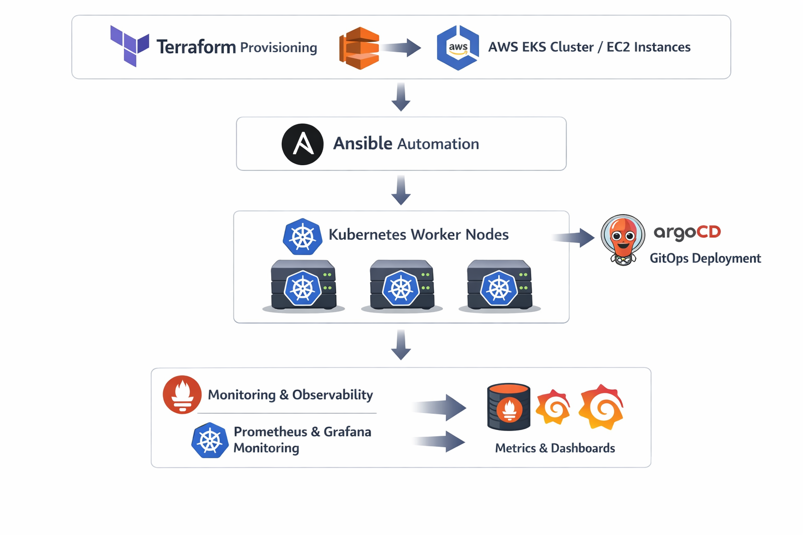

# 🚀 Kubernetes + Ansible Automation Project


## 📌 Project Overview

This project automates the setup of a **Kubernetes cluster on AWS EKS worker nodes using Ansible**.

It provisions and configures:
- 🐳 Docker / containerd runtime
- ☸️ Kubernetes prerequisites
- 📊 Node Exporter for monitoring
- 🔁 Reusable Ansible roles for scalability

---

## 🏗️ Architecture
<p align="center">
  
</p>

------

## ⚙️ Ansible Workflow

<p align="center">
  
</p>

---

## ☸️ Kubernetes Cluster Overview

<p align="center">
  
</p>

---

## 📦 Repository Structure

```bash
inventory.ini        # EC2 / worker node inventory
ansible.cfg          # Ansible configuration
playbooks/           # Main automation playbooks
roles/               # Reusable roles (Docker, K8s, Monitoring)
images/              # Architecture diagrams

```

## ⚙️ Features

- 🔧 Automated Kubernetes worker node setup
- 🐳 Docker / containerd installation
- ☸️ Kubernetes prerequisites configuration
- 🔐 Kernel & system tuning for K8s
- 📊 Node Exporter installation for monitoring
- 📡 Ready for Prometheus scraping
- 🚀 GitOps-ready infrastructure integration

---
